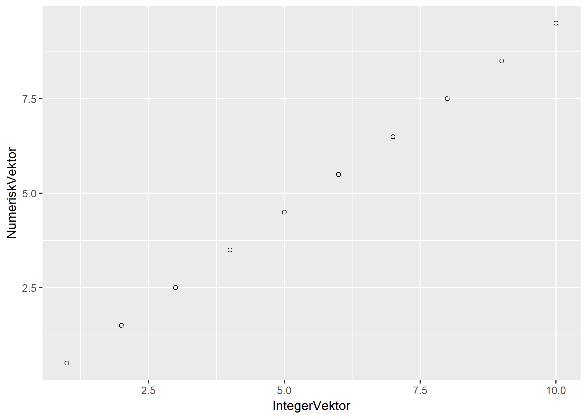
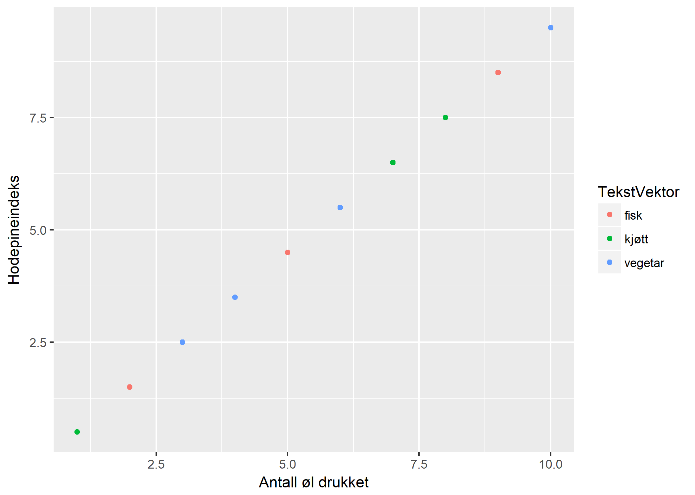
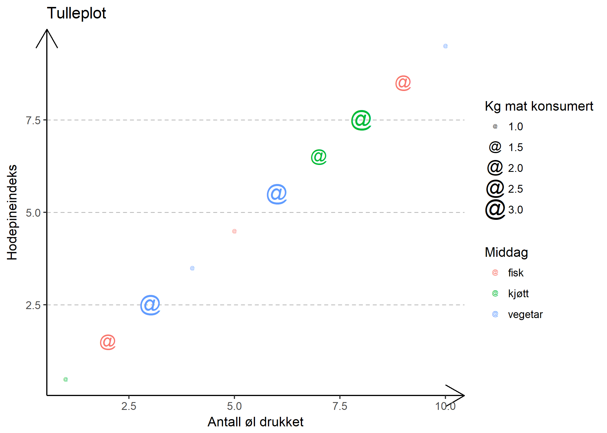

# Velkommen!


# Seminaropplegg

Det er seks undervisningsseminarer, 7. seminar blir det prøve. Dersom noen ikke får til den første prøven, blir det en ny sjanse. Datoen for andre sjanse blir snart tilgjengelig. Dere finner timeplanen for seminarene [her](http://www.uio.no/studier/emner/sv/statsvitenskap/STV1020/v19/timeplan/index.html). Følg med på oppdateringer.

## Nyttige lenker
- [Last ned R](http://cran.uib.no/)
- [Last ned Rstudio](https://www.rstudio.com/products/rstudio/download/#download)
- [Gratis innføringsbok på nett](http://r4ds.had.co.nz/)
- [Stilguide for R](https://google.github.io/styleguide/Rguide.xml)
- [Bruke prosjekter i R](https://support.rstudio.com/hc/en-us/articles/200526207-Using-Projects)
- [Mappestruktureringsforslag](https://nicercode.github.io/blog/2013-04-05-projects/)
- [Guide til ggplot2](http://docs.ggplot2.org/current/)
- [Facebookgruppe for R statsvitenskap UiO](https://www.facebook.com/groups/427792970608618/)

## Om å lære R

For å få fullt utbytte av R som samfunnsvitere, trenger dere følgende ferdigheter:

1. Forståelse av samfunnsvitenskapelig teori og metode
2. Forståelse av statistikk
3. Forståelse av programmering
4. Forståelse av grunnleggende konvensjoner i R, og evnen til finne og forstå koden dere trenger for å kunne gjøre som dere vil i R.

Det kan være vanskelig å lære seg R i begynnelsen, særlig hvis man lærer R uten særlig forkunnskaper i R, statistikk, eller programmering. Da kan man havne i situasjoner der man ikke vet om man har gjort riktig, fordi det er flere ting man er usikker på om man har gjort riktig, og fordi man innser at andre ting kan være feil uten at du vet om det. Vi skal minimere antallet slike situasjoner i fellesskap. Dersom noen føler seg *lost*, er det viktig at dere gjør noe med det, både i form av egeninnsats, og ved å be om hjelp fra medstudenter og meg. Siden det er lett å falle av, er det viktig at du tar ansvar for både deg selv og dine medstudenter, hjelp hverandre med R! Dess bedre innsats dere gjør, dess større blir læringen og omfanget av ferdigheter dere får trent i seminarene.  

Hvis dere gjør deres del, vil ferdighetene dere tilegner dere gjennom R-seminarene gjøre det lettere for dere å forstå statistikk og metode, samt gjøre dere i stand til å gjøre deres egne statistiske analyser i senere emner.

 

## Undervisningsopplegg

**Læringsmål** (fra emnesiden):

* presentere og tolke deskriptiv statistikk
* gjennomføre og tolke resultater fra regresjonsanalyse
* bruke SPSS eller R til databehandling og statistiske analyser

Mitt mål er at dere skal klare å anvende disse ferdighetene selvsikkert og selvstendig.
I tillegg ønsker jeg å lære dere hvordan dere kan tilegne dere ytterligere kunnskap i R på egenhånd. Dersom dere tilegner dere disse ferdighetene, vil dere kunne få stort utbytte av R. 

For å nå disse målene i løpet av 6 seminarer, er vi nødt til å jobbe sammen. Jeg anbefaler følgende opplegg: 

* **Før seminaret:** Gjennomfør introduksjonsmodul til seminaret (Canvas). Les det jeg skriver, og jobb gjennom kode i disse tutorialene grundig. Introduksjonene er spesielt viktig å gjennomføre, for at du skal være i stand til å jobbe selvstendig med oppgaver i seminaret.
* **I seminaret:** 
 + Kort introduksjon til dagens læringsmål
 + Arbeid med oppgaver sammen med naboen
 + Gjennomgang av oppgaver
* **Etter seminaret:** Løs repetisjonsoppgaver i modulen etter seminaret på Canvas. Disse oppgavene vil teste at du klarer å anvende kunnskapen fra seminaret selvstendig. Fasit blir også lenket til i samme modul, men jeg kommer også til å sette av tid til spørsmål om oppgavene ved starten av hvert seminar.

Både oppgavene før og etter seminaret vil være korte, jeg kommer ikke til å kreve at dere bruker mye tid. For dem som vil lære seg mer R, kommer det til å bli noe bonusmateriale.


## Dagens seminar: R basics - en myk start
Jeg håper alle som har tenkt å bruke egen PC/mac har installert R og Rstudio. Dersom dere ikke har gjort dette, bruk en av de stasjonære pcene, eller [åpne Rstudio i kiosk](https://kiosk.uio.no). Dere kan installere Rstudio i pausen.   

Dagens seminar er organisert som en **code-along**, jeg vil at dere skal teste all koden vi går gjennom underveis, dere vil også få noen småoppgaver.

Dersom koden deres ikke virker i løpet av dagens seminar, start med å se etter **skrivefeil**. Sammenlign så koden din med naboens kode, se om hun/han/hen kan hjelpe deg (jeg har også laget et eget [feilsøkingsdokument](https://github.com/langoergen/stv1020R/blob/master/docs/Feils%C3%B8king.md)). R er svært pirkete på skrivefeil, parenteser, komma og små/store bokstaver. Dersom koden fortsatt ikke virker, spør dere meg om hjelp. Ikke nøl med å spørre meg, jeg vil ikke at dere skal sitte og lete lenge etter løsningen på egenhånd i dagens seminar.    

Plan for i dag:

1. [Åpne Rstudio](#Rstudio)
2. [Script og Console som kalkulator](#kalkulator)
3. [Objekter](#objekter)
4. [Kort om funksjoner](#funksjoner)
5. [Vektorer](#vektorer)
6. [Indeksering av vektorer](#indeksering)
7. [Datasett](#datasett)
8. [Grafikk](#grafikk)
9. [Tabulere](#tabulere)

## [1. Åpne Rstudio](#Rstudio)
Rstudio er en IDE (integrated development environment) til R. Rstudio gjør R mer brukervennlig, og har en del tilleggsfunksjonalitet som er nyttig. Derfor bruker vi Rstudio (i motsetning til Field). Rstudio består av 3 vinduer første gang dere åpner det. Til venstre ser dere console. Her vises kode som vi kjører. Oppe til høyre er environment, hvor objekter vi har opprettet vises. Nede til høyre vises filer i mappen vi jobber fra. Fra menyen over vinduet nede til høyre, ser vi at "plot", "packages" og "Help" også vises i dette vinduet. Mer om dette i løpet av dagens seminar, dersom dere fortsatt har spørsmål om hvordan Rstudio virker etter seminaret, ber jeg om at dere ser på forklaringen jeg har lagt ut på [nett](https://github.com/langoergen/stv1020R/blob/master/for_seminaret/for_seminar1.md), eller sender meg et spørsmål på slack.


Det viktigste vinduet må vi imidlertid opprette selv. Klikk på arket med en grønn sirkel med et plusstegn like under `File` øverst til venstre, og velg `R Script`. Vi har nå opprettet et R-script. Vi skriver all kode i R-script, fordi r-script lar oss skrive, redigere, kommentere og lagre kode. I tillegg hjelper R-studio oss med å rette og organisere kode som skrives i R-script. R-script hjelper oss med å gjøre arbeidet vårt **reproduserbart**. For å kjøre koden på en linje i et r-script, naviger til linjen og trykk `ctrl + enter` (`Cmd` i stedet for `Ctrl` for dem som bruker mac). forsøk med `1 + 1`. Når dere kjører kode, kjøres all koden dere har markert. Dersom dere ikke har markert kode, kjøres koden på den linjen musepekeren er.

## [2. Script og Console som kalkulator](#kalkulator)


```r
# UTREGNING:
1 + 1
```

```
## [1] 2
```

```r
## VI 'SPØR' R OM VI HAR RIKTIG SVAR: HVIS 1 + 1 BLIR 2, VIL R SVARE TRUE, HVIS 1 + 1 IKKE
## BLIR 2, VIL DEN SVARE FALSE
1 + 1 == 2
```

```
## [1] TRUE
```

```r
1 + 2 == 2
```

```
## [1] FALSE
```

```r
## KONSOLLEN EVALUERER IKKE TING SOM KOMMER ETTER '#'
10 * 10  # + 10 * 3
```

```
## [1] 100
```

## [3. Objekter](#objekter)

I R lager vi objekter av informasjon. Det betyr: vi "lagrer" informasjonen vår midlertidig i programmet (men ikke på maskinen!). Vi kan lagre hva som helst, det eneste vi trenger å gjøre er å gi objektet med informasjonen vår et navn, og be R om å huske på objektet. 


Vi lager objekter ved hjelp av `<-`. Før `<-` må vi velge et navn på objektet med informasjonen vi vil lagre. Etter `<-` må vi angi informasjonen vi vil at R skal lagre i objektet. La oss forsøke:


```r
et_tall <- 10
et_tall
```

```
## [1] 10
```

Vi trenger ikke begrense oss til tall:

```r
navn <- "Hva skal den inneholde da?!?"
navn
```

```
## [1] "Hva skal den inneholde da?!?"
```

```r
Navn <- "Hvertfall ikke dét"
navn <- 10
```

Et objekt kan inneholde mange tall:

```r
Vektor <- 1:10  # LEGG MERKE TIL AT ':' LAGER EN REKKE AV TALL FRA 1 TIL 10.
Vektor
```

```
##  [1]  1  2  3  4  5  6  7  8  9 10
```

Objekter kan hete hva som helst:

```r
lars_sponheim <- "Hver mann sin høne!"
lars_sponheim
```

```
## [1] "Hver mann sin høne!"
```

Ved å kjøre navnet til et objekt, kan vi hente ut informasjonen objektet inneholder, og anvende informasjonen. Akkurat som vi gjorde over, kan vi gjøre regnestykker med objekter som inneholder tall (men ikke med objekter som inneholder tekst!):


```r
Ti <- 10
Ti
```

```
## [1] 10
```

```r
Ti + Vektor
```

```
##  [1] 11 12 13 14 15 16 17 18 19 20
```

```r
Ti * Vektor
```

```
##  [1]  10  20  30  40  50  60  70  80  90 100
```

```r
Ti/Vektor
```

```
##  [1] 10.000000  5.000000  3.333333  2.500000  2.000000  1.666667  1.428571
##  [8]  1.250000  1.111111  1.000000
```

```r
Vektor^2
```

```
##  [1]   1   4   9  16  25  36  49  64  81 100
```

```r
Vektor^Ti
```

```
##  [1]           1        1024       59049     1048576     9765625
##  [6]    60466176   282475249  1073741824  3486784401 10000000000
```

Merk for øvrig at R er sensitivt til store og små bokstaver:

```r
navn
```

```
## [1] 10
```

```r
Navn
```

```
## [1] "Hvertfall ikke dét"
```

```r
summary(navn)
```

```
##    Min. 1st Qu.  Median    Mean 3rd Qu.    Max. 
##      10      10      10      10      10      10
```

```r
# (Summary(navn)
```


Oppgave: Lag et objekt med samme navn som fornavnet ditt, som inneholder alderen din.

## [4. Kort om funksjoner](#funksjoner)

Dersom vi ønsker å gjøre noe i r, får vi som regel en funksjon til å gjøre jobben for oss. En funksjon er en kodesnutt hvor vi spesifiserer input (informasjon av et eller annet slag, f.eks. variabler) som funksjonen omarbeider og deretter returnerer (referes til som value i hjelpefiler i R).

Hoveddelen av det vi skal gjøre i disse seminarene, er å lære massevis av funksjoner og hvordan man bruker dem. Funksjoner kan gjøre enkle ting, som å finne gjennomsnitt. Funksjoner kan også brukes til avanserte ting, som å kjøre hundrevis av regresjonsanalyser.

Alle funksjoner har samme struktur:

```r
funksjonsnavn(argument1 = , argument2 = , ... argumentK =)

funksjonsnavn = NAVNET PÅ FUNKSJONEN
argument = "INSTILLINGER" TIL FUNKSJONEN.
# Disse linjene er ikke gyldig R-kode, men linjene viser den generelle syntaksen til funksjoner i R
```

Hjelpesiden til en funksjon finner man ved å kjøre `?funksjonsnavn`.
Der finner man argumentene til en funksjon, og standardinnstillingene for funksjonen.

Som regel er det første argumentet input, dvs. informasjonen som funksjonen skal bearbeide for å produsere output.
Dvs.: `funksjonsnavn(argument1 = input)` 
Veldig ofte vil input til en funksjon være et objekt. 

Eksempel (husk at objektet vårt, `Vektor`, inneholder 1 til 10):

```r
mean(x = Vektor)
```

```
## [1] 5.5
```


mean har et argument, `na.rm =`
I hjelpefilen ser vi at `na.rm =` sin standardinnstilling er `"FALSE"`
`na.rm =` står for "NA remove". "NA" står for not available, og er det samme som "missing" i pensum.
Argumentet na.rm vil dukke opp i mange funksjoner.

Man kan ikke beregne et gjennomsnitt dersom man mangler informasjon om en av enhetene som gjennomsnittet er beregnet over. Derfor fungerer ikke `mean()` hvis vi endrer `Vektor` til følgende:

```r
Vektor2 <- c(10, 2, 3, NA)
mean(x = Vektor2, na.rm = FALSE)
```

```
## [1] NA
```

```r
## VED Å SETTE na.rm=TRUE, FJERNER R ALLE 'NA' FØR DEN BEREGNER GJENNOMSNITTET:
mean(x = Vektor2, na.rm = TRUE)
```

```
## [1] 5
```


Ellers har R `mean` og mange andre nyttige matematiske funksjoner til statistikk:

```r
Vektor <- 1:10
mean(Vektor)
```

```
## [1] 5.5
```

```r
mean(Ti + Vektor)
```

```
## [1] 15.5
```

```r
mean(Ti) + Vektor
```

```
##  [1] 11 12 13 14 15 16 17 18 19 20
```

```r
mean(Vektor) + Ti
```

```
## [1] 15.5
```

Her er noen andre funksjoner i R som kan brukes til matematikk:

```r
median(Vektor)
```

```
## [1] 5.5
```

```r
sum(Vektor)
```

```
## [1] 55
```

```r
sd(Vektor)
```

```
## [1] 3.02765
```

```r
sqrt(Vektor)
```

```
##  [1] 1.000000 1.414214 1.732051 2.000000 2.236068 2.449490 2.645751
##  [8] 2.828427 3.000000 3.162278
```

```r
length(Vektor)
```

```
## [1] 10
```

Oppgave: Test om dere henger med på disse alternative måtene å regne ut gjennomsnittet av `Vektor` (vi kunne brukt `mean()`). Den siste delen av koden oppretter en funksjon som beregner gjennomsnitt. Se om du klarer å modifisere denne funksjonen slik at den returnerer gjennomsnitt det dobbelte av gjennomsnittet.


```r
sum(Vektor)/length(Vektor)
```

```
## [1] 5.5
```

```r
gj_snitt <- function(x) {
    sum(x)/length(x)
}
gj_snitt(Vektor)
```

```
## [1] 5.5
```


## [5. Vektorer](#vektorer)
Vi kan lagre en variabel som en vektor. En vektor er en rekke av elementer av samme type, som er ordnet i en bestemt rekkefølge (dette gjelder universelt, ikke bare r)"

Et datasett er bare mange vektorer ved siden av hverandre (med en bestemt rekkefølge, slik at hver rad indikerer en enhet). 

Hva betyr det at en vektor har elementer av samme type? 
Det betyr at du ikke kan slå sammen tall og tekst i en vektor. 
Hvilken type vektoren har, finner vi med funksjonen `class()`. 
En annen funksjon som gir oss nyttig info om alle slags objekter er `str()`, prøv!

For å lage en vektor, kan vi bruke funksjoner som `:` og `c()`. 
Vi har særlig 5 typer vektorer:

**HELTALL (INTEGER):**

```r
IntegerVektor <- 1:10
class(IntegerVektor)
```

```
## [1] "integer"
```

```r
summary(IntegerVektor)
```

```
##    Min. 1st Qu.  Median    Mean 3rd Qu.    Max. 
##    1.00    3.25    5.50    5.50    7.75   10.00
```


**NUMERISK, ALTSÅ MED DESIMALER (NUMERIC):**

```r
NumeriskVektor <- 0.5:10
NumeriskVektor
```

```
##  [1] 0.5 1.5 2.5 3.5 4.5 5.5 6.5 7.5 8.5 9.5
```

```r
class(NumeriskVektor)
```

```
## [1] "numeric"
```

```r
summary(NumeriskVektor)
```

```
##    Min. 1st Qu.  Median    Mean 3rd Qu.    Max. 
##    0.50    2.75    5.00    5.00    7.25    9.50
```

**TEKST (CHARACTER):**

```r
TekstVektor <- c("kjøtt", "fisk", "vegetar", "vegetar", "fisk", "vegetar", "kjøtt", "kjøtt", 
    "fisk", "vegetar")
class(TekstVektor)
```

```
## [1] "character"
```

```r
summary(TekstVektor)
```

```
##    Length     Class      Mode 
##        10 character character
```

```r
table(TekstVektor)
```

```
## TekstVektor
##    fisk   kjøtt vegetar 
##       3       3       4
```

**FAKTOR, ELLER "KATEGORIER" (FACTOR):**

```r
FaktorVektor <- c("Liten", "Middels", "Stor", "Liten", "Liten", "Stor", "Middels", "Stor", 
    "Middels", "Liten")
FaktorVektor <- factor(FaktorVektor)
`?`(factor)
```

```
## starting httpd help server ... done
```

```r
FaktorVektor <- factor(c("Liten", "Middels", "Stor", "Liten", "Liten", "Stor", "Middels", "Stor", 
    "Middels", "Liten"))

class(FaktorVektor)
```

```
## [1] "factor"
```

```r
levels(FaktorVektor)  # LEGG MERKE TIL AT R HAR KATEGORISERT -- ALFABETISK
```

```
## [1] "Liten"   "Middels" "Stor"
```

```r
summary(FaktorVektor)
```

```
##   Liten Middels    Stor 
##       4       3       3
```


**LOGISKE, SOM BARE TAR VERDIEN TRUE ELLER FALSE, (LOGICAL):**

```r
LogiskVektor <- c(TRUE, TRUE, FALSE, TRUE, FALSE, FALSE, TRUE, FALSE, FALSE, FALSE)
class(LogiskVektor)
```

```
## [1] "logical"
```


Hvis du prøver å sette sammen elementer av forskjellig type, vil de konverteres til elementet med lavest målenivå.


```r
eksempel1 <- c("Tekst", 4, TRUE)

class(eksempel1)
```

```
## [1] "character"
```

```r
str(eksempel1)  # str forteller oss også at eksempel1 er character, men forkorter til chr
```

```
##  chr [1:3] "Tekst" "4" "TRUE"
```

```r
eksempel1
```

```
## [1] "Tekst" "4"     "TRUE"
```


Oppgave: kjør koden under, hva kan du si om målenivået til "liste" og "ikkeliste"?


```r
liste <- list(c("tekst", "tekst2"), 4, c(TRUE, FALSE))
class(liste)
```

```
## [1] "list"
```

```r
str(liste)
```

```
## List of 3
##  $ : chr [1:2] "tekst" "tekst2"
##  $ : num 4
##  $ : logi [1:2] TRUE FALSE
```

```r
ikkeliste <- unlist(liste)
class(ikkeliste)
```

```
## [1] "character"
```

```r
str(ikkeliste)
```

```
##  chr [1:5] "tekst" "tekst2" "4" "TRUE" "FALSE"
```

Unngå å blande målenivåer (med mindre det er en god grunn til å gjøre det), vektorer bestående av elementer av samme type er som regel lettest å jobbe med.


## [6. Indeksering av vektorer](#indeksering)

Hva betyr indeksering?
- hvis vi har en vektor med 10 elementer, men vil ha ut element nr. 5, må vi på en eller annen måte be R om gi oss element nr. 5.
Da bruker vi `[]`. Indeksering går alså ut på å angi en oppskrift for å hente ut den informasjonen vi er interessert i.


```r
FaktorVektor
```

```
##  [1] Liten   Middels Stor    Liten   Liten   Stor    Middels Stor   
##  [9] Middels Liten  
## Levels: Liten Middels Stor
```

```r
FaktorVektor[3]
```

```
## [1] Stor
## Levels: Liten Middels Stor
```

```r
NumeriskVektor
```

```
##  [1] 0.5 1.5 2.5 3.5 4.5 5.5 6.5 7.5 8.5 9.5
```

```r
NumeriskVektor[3]
```

```
## [1] 2.5
```

```r
FaktorVektor[5]
```

```
## [1] Liten
## Levels: Liten Middels Stor
```

```r
NumeriskVektor[1:5]
```

```
## [1] 0.5 1.5 2.5 3.5 4.5
```

Ofte er vi ikke ute etter akkurat element nummer 3 eller 5, men etter de delene av en vektor som tilfredsstiller ett eller annet. For eksempel vil vi kanskje ha ut de som har stemt venstre i en spørreundersøkelse, alle med inntekt under 400 000 eller lignende.

`which()` svarer oss på "hvilke deler av dette objektet tilfredsstiller <et eller annet>. For eksempel:

```r
NumeriskVektor
```

```
##  [1] 0.5 1.5 2.5 3.5 4.5 5.5 6.5 7.5 8.5 9.5
```

```r
NumeriskVektor >= 5
```

```
##  [1] FALSE FALSE FALSE FALSE FALSE  TRUE  TRUE  TRUE  TRUE  TRUE
```

```r
which(NumeriskVektor >= 5)
```

```
## [1]  6  7  8  9 10
```

Ved å putte `which()` inn i `[]` henter vi ut de elementene som tilfredsstiller kriteriene for det vi ber om:


```r
NumeriskVektor[which(NumeriskVektor >= 8)]  ##  DISSE GIR ALTSÅ SAMMERESULTAT
```

```
## [1] 8.5 9.5
```

```r
which(NumeriskVektor >= 8)
```

```
## [1]  9 10
```

```r
NumeriskVektor[9:10]  ##  DISSE GIR ALTSÅ SAMME RESULTAT
```

```
## [1] 8.5 9.5
```


På samme måte kan vi stille R forskjellige spørsmål som programmet svarer på:

```r
LogiskVektor
```

```
##  [1]  TRUE  TRUE FALSE  TRUE FALSE FALSE  TRUE FALSE FALSE FALSE
```

```r
LogiskVektor == FALSE
```

```
##  [1] FALSE FALSE  TRUE FALSE  TRUE  TRUE FALSE  TRUE  TRUE  TRUE
```

```r
## HER SPØR VI PROGRAMMET: 'ER ELEMENTET I LogiskVektor FALSE? SÅ GIR DEN OSS TRUE (JA DET
## ER FALSE),

which(LogiskVektor == FALSE)
```

```
## [1]  3  5  6  8  9 10
```

```r
## HER SPØR VI PROGRAMMET: 'HVILKE ELEMENTER I LogiskVektor ER FALSE? SÅ GIR DEN OSS DE
## ELEMENTNUMRENE SOM HAR FALSE
```


Oppgave: lag en vektor bestående av alle heltall fra 100 til 1 (i synkende rekkefølge), og indekser element 20 til 40 fra denne vektoren. Du har gjort riktig dersom du får heltallene fra 81 til 61 i console.


## [7. Datasett](#datasett)

Et datasett er mange vektorer satt sammen som kolonner. Rekkefølgen Er viktig: Hver rad indikerer en viss enhet.

Vi kan lage et datasett av vektorene våre slik (legg merke til argumentet `stringsAsFactors`, vanligvis blir tekst-vektorer omgjort til faktorer, men det skrur vi av ved å sette dette argumentet til `FALSE`): 


```r
datasett <- data.frame(IntegerVektor, NumeriskVektor, TekstVektor, FaktorVektor, LogiskVektor, 
    stringsAsFactors = FALSE)
TekstVektor
```

```
##  [1] "kjøtt"   "fisk"    "vegetar" "vegetar" "fisk"    "vegetar" "kjøtt"  
##  [8] "kjøtt"   "fisk"    "vegetar"
```

```r
class(datasett)
```

```
## [1] "data.frame"
```

```r
datasett
```

```
##    IntegerVektor NumeriskVektor TekstVektor FaktorVektor LogiskVektor
## 1              1            0.5       kjøtt        Liten         TRUE
## 2              2            1.5        fisk      Middels         TRUE
## 3              3            2.5     vegetar         Stor        FALSE
## 4              4            3.5     vegetar        Liten         TRUE
## 5              5            4.5        fisk        Liten        FALSE
## 6              6            5.5     vegetar         Stor        FALSE
## 7              7            6.5       kjøtt      Middels         TRUE
## 8              8            7.5       kjøtt         Stor        FALSE
## 9              9            8.5        fisk      Middels        FALSE
## 10            10            9.5     vegetar        Liten        FALSE
```

```r
`?`(data.frame)
```


For å gjøre det mer elegant kan vi spesifisere navn på kolonnene:

```r
datasett2 <- data.frame(id = IntegerVektor, sovn = NumeriskVektor, middag = TekstVektor, mengde = FaktorVektor, 
    stringsAsFactors = FALSE)
datasett2
```

```
##    id sovn  middag  mengde
## 1   1  0.5   kjøtt   Liten
## 2   2  1.5    fisk Middels
## 3   3  2.5 vegetar    Stor
## 4   4  3.5 vegetar   Liten
## 5   5  4.5    fisk   Liten
## 6   6  5.5 vegetar    Stor
## 7   7  6.5   kjøtt Middels
## 8   8  7.5   kjøtt    Stor
## 9   9  8.5    fisk Middels
## 10 10  9.5 vegetar   Liten
```

Med `View()` kan vi se på datasettet i stedet for å printe i konsollen:


```r
View(datasett2)
```

For å hente ut en kolonne, bruker vi `$` slik:
`navn på datasettet$navn på kolonne`

```r
datasett2$sovn
```

```
##  [1] 0.5 1.5 2.5 3.5 4.5 5.5 6.5 7.5 8.5 9.5
```

```r
datasett2$middag
```

```
##  [1] "kjøtt"   "fisk"    "vegetar" "vegetar" "fisk"    "vegetar" "kjøtt"  
##  [8] "kjøtt"   "fisk"    "vegetar"
```

Og indekserer på samme måte som ovenfor:

```r
datasett2$middag[which(datasett2$middag == "fisk")]
```

```
## [1] "fisk" "fisk" "fisk"
```

```r
datasett2$sovn[which(datasett2$middag == "fisk")]
```

```
## [1] 1.5 4.5 8.5
```

```r
datasett2
```

```
##    id sovn  middag  mengde
## 1   1  0.5   kjøtt   Liten
## 2   2  1.5    fisk Middels
## 3   3  2.5 vegetar    Stor
## 4   4  3.5 vegetar   Liten
## 5   5  4.5    fisk   Liten
## 6   6  5.5 vegetar    Stor
## 7   7  6.5   kjøtt Middels
## 8   8  7.5   kjøtt    Stor
## 9   9  8.5    fisk Middels
## 10 10  9.5 vegetar   Liten
```


Vi må ikke bruke `$`. Vi kan også bruke `[]`. Når et objekt har flere dimensjoner (Datasett har 2, rader og kolonner), kan vi bruke komma i [,] til å skille mellom dimensjonene. For rader og kolonner i datasett gjør vi dette slik:
`[rad, kolonne]`


```r
dim(datasett)
```

```
## [1] 10  5
```

```r
datasett[3, 4]
```

```
## [1] Stor
## Levels: Liten Middels Stor
```

```r
datasett[2:5, 3]
```

```
## [1] "fisk"    "vegetar" "vegetar" "fisk"
```

```r
datasett2[c(1, 3), c(2, 3)]
```

```
##   sovn  middag
## 1  0.5   kjøtt
## 3  2.5 vegetar
```

```r
## HVIS DET ER TOMT PÅ ENTEN PLASSEN TIL RADER ELLER TIL KOLONNER, HENTER R ALLE:
datasett2[2:5, ]
```

```
##   id sovn  middag  mengde
## 2  2  1.5    fisk Middels
## 3  3  2.5 vegetar    Stor
## 4  4  3.5 vegetar   Liten
## 5  5  4.5    fisk   Liten
```

```r
datasett2[which(datasett2$sovn >= 5), ]
```

```
##    id sovn  middag  mengde
## 6   6  5.5 vegetar    Stor
## 7   7  6.5   kjøtt Middels
## 8   8  7.5   kjøtt    Stor
## 9   9  8.5    fisk Middels
## 10 10  9.5 vegetar   Liten
```

Vi kan også bruke navnene på kolonnene:

```r
datasett[, "NumeriskVektor"]
```

```
##  [1] 0.5 1.5 2.5 3.5 4.5 5.5 6.5 7.5 8.5 9.5
```

```r
datasett2[, c("sovn", "middag")]
```

```
##    sovn  middag
## 1   0.5   kjøtt
## 2   1.5    fisk
## 3   2.5 vegetar
## 4   3.5 vegetar
## 5   4.5    fisk
## 6   5.5 vegetar
## 7   6.5   kjøtt
## 8   7.5   kjøtt
## 9   8.5    fisk
## 10  9.5 vegetar
```


`c()` brukes til å kombinere elementer i den ordnede rekkefølgen vi ønsker: 

```r
datasett[c(6, 5, 2), c("TekstVektor", "NumeriskVektor", "IntegerVektor")]
```

```
##   TekstVektor NumeriskVektor IntegerVektor
## 6     vegetar            5.5             6
## 5        fisk            4.5             5
## 2        fisk            1.5             2
```

```r
datasett[c(6, 5, 2), c(2, 3)]
```

```
##   NumeriskVektor TekstVektor
## 6            5.5     vegetar
## 5            4.5        fisk
## 2            1.5        fisk
```

```r
datasett
```

```
##    IntegerVektor NumeriskVektor TekstVektor FaktorVektor LogiskVektor
## 1              1            0.5       kjøtt        Liten         TRUE
## 2              2            1.5        fisk      Middels         TRUE
## 3              3            2.5     vegetar         Stor        FALSE
## 4              4            3.5     vegetar        Liten         TRUE
## 5              5            4.5        fisk        Liten        FALSE
## 6              6            5.5     vegetar         Stor        FALSE
## 7              7            6.5       kjøtt      Middels         TRUE
## 8              8            7.5       kjøtt         Stor        FALSE
## 9              9            8.5        fisk      Middels        FALSE
## 10            10            9.5     vegetar        Liten        FALSE
```


Oppgave: Lag tekstvektoren `tekst`, som består av de to verdiene `"to"` og `"tre"` (altså av ordene som tekst).
Lag også tallvektoren `tall` bestående av tallene fra 1 til 10. Opprett deretter et datasett bestående av de to variablene ved hjelp av `data.frame()`. Inspiser data, og diskuter hva som skjer med sidemannen.

## [8. Grafikk](#grafikk)

Grafikk er helt sentralt, både for å forstå og for å formidle statistiske resultater (og fordi det er gøy).Vi kan lage et helt enkelt to-dimensjonalt plot med `plot()`. Det fungerer slik: `plot(x-aksen, y-aksen)`

```r
plot(datasett$IntegerVektor, datasett$NumeriskVektor)
```

<!-- -->

Vi kommer til å bruke funksjonen `ggplot()` fra pakken `ggplot2`, som er en annen måte å plotte på - ofte enklere enn `plot()` synes jeg. Det finnes ekstremt mange pakker som inneholder funksjoner som ikke inngår i grunninnstallasjonen av R. For å bruke funksjoner fra pakker, må vi kjøre to linjer med kode:

```r
install.packages("ggplot2")  # for installasjon: pakkenavn i ''
library(ggplot2)  # for å laste inn pakke: pakkenavn uten ''
```


Nå kan vi bruke funksjonen `ggplot()` fra pakken `ggplot2`:

```r
prikkeplot <- ggplot(datasett, aes(x = IntegerVektor, y = NumeriskVektor))
prikkeplot
```

<!-- -->


```r
## VI MÅ LEGGE TIL EN 'LAYER' FOR Å FÅ INN DATA
prikkeplot + geom_point()
```

<!-- -->

```r
prikkeplot
```

<!-- -->


```r
## (FULL OVERSIKT OVER PUNKTER FINNER DU HER:
## http://sape.inf.usi.ch/quick-reference/ggplot2/shape)
prikkeplot + geom_point(shape = 1)
```

<!-- -->





```r
## VI KAN OGSÅ FARGELEGGE BASERT PÅ VERDIEN I EN ANNEN KOLONNE:
prikkeplot <- prikkeplot + geom_point(aes(color = TekstVektor))
prikkeplot
```

<!-- -->


```r
## LA OSS SETTE NAVN PÅ X- OG Y-AKSEN
prikkeplot <- prikkeplot + labs(x = "Antall øl drukket", y = "Hodepineindeks")
prikkeplot
```

<!-- -->





De som vil ha mer å bryne seg på, kan prøve å forstå alt som foregår her (bruk `?`):

```r
ggplot(datasett, aes(x = IntegerVektor, y = NumeriskVektor)) + geom_point(aes(color = TekstVektor, 
    size = as.numeric(FaktorVektor)), shape = 64) + labs(x = "Antall øl drukket", y = "Hodepineindeks", 
    color = "Middag", size = "Kg mat konsumert", title = "Tulleplot") + theme_classic() + theme(panel.grid.major.y = element_line(color = "gray", 
    linetype = "dashed"), axis.line = element_line(arrow = arrow()))
```

<!-- -->




`ggplot()` gjør det lett å se mange variabler i sammenheng, men vi må ofte jobbe for å visualisere mye informasjon på en effektiv måte. Her er et forsøk på å gjøre forrige plot litt ryddigere:


```r
install.packages("ggthemes")
library(ggthemes)
```


```r
ggplot(datasett, aes(x = IntegerVektor, y = NumeriskVektor)) + geom_point(aes(color = TekstVektor, 
    size = as.numeric(FaktorVektor)), shape = 1) + labs(x = "Antall øl drukket", y = "Hodepineindeks", 
    color = "Middag", size = "Kg mat konsumert", title = "Tulleplot") + theme_tufte() + theme(panel.grid.major.y = element_line(color = "gray", 
    linetype = "dashed"), axis.line = element_line(arrow = arrow()))
```

<!-- -->


## [9. Tabulere](#tabulere)

Tabulering er en sentral del av pensum. For å lage tabeller og krysstabeller, bruker vi `table()`. For å forstå variabler på lave målenivå, er tabeller svært nyttig.


```r
table(datasett$IntegerVektor)
```

```
## 
##  1  2  3  4  5  6  7  8  9 10 
##  1  1  1  1  1  1  1  1  1  1
```

```r
table(datasett$LogiskVektor)
```

```
## 
## FALSE  TRUE 
##     6     4
```

```r
table(datasett$FaktorVektor)  ##  ALTSÅ: 4 ENHETER HAR VERDIEN 'Liten'
```

```
## 
##   Liten Middels    Stor 
##       4       3       3
```

```r
table(datasett$FaktorVektor, datasett$LogiskVektor)  ## 3 ENHETER HAR KOBINASJONEN 'Stor' OG 'FALSE'
```

```
##          
##           FALSE TRUE
##   Liten       2    2
##   Middels     1    2
##   Stor        3    0
```


Som med all annen informasjon, kan vi lagre tabeller som objekter:

```r
tabell <- table(datasett$FaktorVektor, datasett$LogiskVektor)

tabell
```

```
##          
##           FALSE TRUE
##   Liten       2    2
##   Middels     1    2
##   Stor        3    0
```

```r
class(tabell)
```

```
## [1] "table"
```

```r
str(tabell)
```

```
##  'table' int [1:3, 1:2] 2 1 3 2 2 0
##  - attr(*, "dimnames")=List of 2
##   ..$ : chr [1:3] "Liten" "Middels" "Stor"
##   ..$ : chr [1:2] "FALSE" "TRUE"
```


I stedet for å få antall enheter, kan vi beregne andel enheter:


```r
sum(tabell)  ##  DET ER TI ENHETER. DELER VI HVER CELLE I TABELLEN PÅ DETTE, FÅR VI ANDEL.
```

```
## [1] 10
```

```r
tabell/sum(tabell)  ##  ANDEL
```

```
##          
##           FALSE TRUE
##   Liten     0.2  0.2
##   Middels   0.1  0.2
##   Stor      0.3  0.0
```

```r
tabell_andel <- tabell/sum(tabell)
```

Vi kan reprodusere alt arbeidet vi har gjort i dag, inkludert data med R-scriptet.
Siden vi ikke trenger dataene vi har laget, kan vi fjerne alt fra `Environment`.

```r
rm(list = ls())
```


Lagre scriptet på pcen deres ved å trykke på `ctrl/cmd + s` (dere kan skifte working directory først). Jeg anbefaler at dere oppretter en egen mappe for R-seminarene. Kall filen for seminar1. Filen skal nå dukke opp under files i panelet nede til høyre som "seminar1.R". Du kan nå avslutte Rstudio. Du vil bli spurt om å lagre workspace image, takk nei til dette.

## Til neste gang...

Før vi møtes neste gang, ber jeg om at dere:

1. Forsøker å løse hjemmeoppgavene. 
2. Melder dere inn i slack-gruppen (dere har fått invitasjon på canvas, send meg en mail hvis ikke). Still meg spørsmål dersom det er noe du ikke får til.
3. Går gjennom introduksjonen til neste seminar. 


## Takk for i dag!

