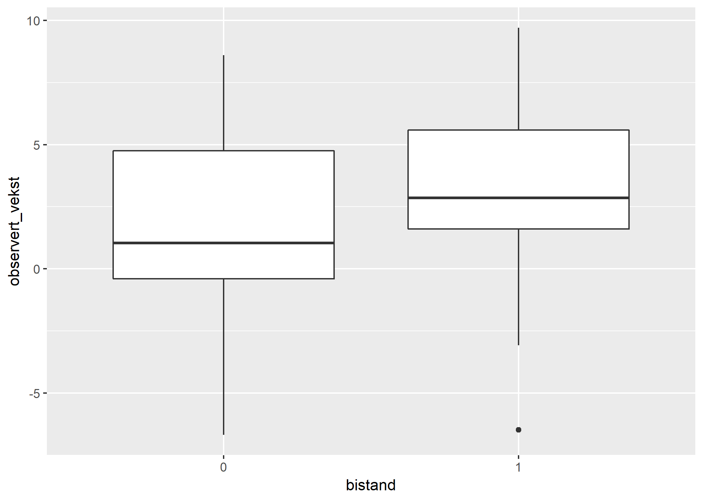

```{r setup, include=FALSE}
knitr::opts_chunk$set(echo = TRUE)
```

# Velkommen til 3. Seminar!

Først: Er det noen spørsmål/kommentarer til hjemmeoppgavene?

I dagens seminar skal vi dekke følgende emner:

1. [Dataanalyse i praksis](#praksis)
2. [Omkoding](#omkoding)
3. [Eksperimentell logikk](#eksperiment)
4. [Aggregering og arrangering av data med dplyr](#dplyr)


## Dataanalyse i praksis

I dette, og neste seminar, skal vi gjøre ekte forskning (riktignok forskning andre har gjort før oss). Vi skal jobbe med replikasjon av en publisert forskningsartikkel: 
*Burnside, C., & Dollar, D. (2000). Aid, policies, and growth. American economic review, 90(4), 847-868.*

Valget av denne artikkelen er ikke tilfeldig, den er svært godt egnet til å lære dataanalyse med lineær regresjon. Videre er datasettetsom ble brukt i artikkelen offentlig tilgjengelig.

Vi skal se nærmere på en av hypotesene til **Burnside og Dollar (2000)**: *Effekten av bistand på økonomisk utvikling avhenger av den makroøkonomiske politikken som føres i landet som får bistand*.  
Denne hypotesen testes i regresjonsmodell 5 fra tabell 4 på s. 856. Vi skal se på den første spesifikasjonen av denne modellen (kolonnen **OLS**), som er en multivariat, lineær regresjon med samspill. 

I dagens seminar, skal vi jobbe med å forstå grunnlaget for slutningene regresjonsmodell 5 gir oss, uten å gjøre selve regresjonsanalysen. Vi kan skille mellom 2 fremgangsmåter å gjøre dette på:

1. **Teoretisk**: les artikkel og kodebok (i dette tilfellet i artikkelen), og tenk gjennom grunnlaget for slutningene. Dette innebærer å stille spørsmål som dette: Hvilke valg (f.eks. spesifikasjon av variabler) tar forfatterne for å kunne teste hypotesen sin? Hvilke andre valg kunne forfatterne tatt? Gjør forfatterne noen implisitte antagelser gjennom valgene sine? Er begrunnelsene for valgene forfatterne tar gode? Dersom du fikk tilgang på all informasjon du hadde lyst på, og kunne lage et eksperiment, hvordan ville du godt frem? Hvordan skiller den faktiske analysen seg fra den ideelle analysen? 
2. **Vurdering av den empiriske slutningen (ved hjelp av R)**: Vi kan bruke deskriptiv statistikk, plotting og regresjonsdiagnostikk til å øke forståelsen vår av datagrunnlaget for slutningen fra modell 5. Ved å studere data og statistikker for regresjon nærmere, kan vi få et inntrykk av om sammenhengen virker robust. Videre kan vi teste konsekvensen av å gjøre andre valg enn det forfatterne av en artikkel gjorde, for eksempel ved å legge inn eller fjerne kontrollvariabler, eller kode variabler på andre måter enn det forfatterne gjorde. Dersom vi synes at kodingen av en variabel er vilkårlig fordi den mangler en god begrunnelse,  kan vi teste om slutningene regresjonsmodellen gir er robust til omkoding av variabelen. 

En god vurdering av den empiriske støtten for en statistisk modell bør inneholde både en vurdering av det teoretiske grunnlaget for slutningen, og en vurdering av den faktiske empiriske slutningen. Selv om vi ofte får informasjon som gir oss noe grunnlag for å vurdere den empiriske slutningen, er det stort sett alltid mer å hente ved å undersøke grunnlaget for den statistiske slutningen selv. 

I oppgavene til dagens seminar skal vi først og fremst se på univariate og bivariate sammenhenger, men det er også noen multivariate slutninger. Det viktigste med tanke på R-prøven, er å forstå hvordan koden fungerer, dere trenger ikke henge dere altfor mye opp i det empiriske grunnlaget for slutningen i modell 5 om dere ikke har lyst. Jeg vil likevel påstå at det er vel verdt å bruke tid på å forstå dataanalysene vi gjennomfører i dette og neste seminar, da det kan gi dere en økt forståelse av regresjonsanalyse, og dataanalyse generelt. 

## Omkoding av variabler

For å spesifisere regresjonsmodell 5 hos **Burnside og Dollar (2000)**, må vi først gjøre noen omkodinger. Dersom dere leser artikkelen, vil dere se at nødvendigheten av alle disse omkodingene ikke fremgår av beskrivelsen av modellen. Det burde de ha gjort. Dersom vi ikke helt vet hvordan en regresjon er spesifisert, kan vi ikke vurdere alle forutsetningene for slutningene modellen gir. Heldigvis muliggjør omkoding av variabler i datasettet som følger med artikkelen replikasjon av modell 5. Jeg skal nå vise disse omkodingene. Jeg har gjemt koden for å laste inn datasettet, siden det er den første oppgaven til dagens seminar. Jeg har kalt datasettet for **aidgrowth**


```{r, echo = F}
aidgrowth <- read.csv("https://raw.githubusercontent.com/martigso/stv1020R/master/data/aidgrowth.csv",
                stringsAsFactors = FALSE)


```

Vi skal se på eksempler på tre forskjellige typer omkodinger. Jeg legger ut en mer komplett liste over funksjoner for omkodinger i et oversiktsdokument.

### Omkoding av variabler med matematiske transformasjoner

Når vi omkoder variabler i et datasett, har vi lyst til å opprette en ny variabel. Dersom vi ikke gjør dette, erstatter vi informasjonen i den opprinnelige variabelen. Informasjonen i den opprinnelige variabelen er uunværlig for å teste at omkodingen har fungert som vi ønsker. Den er enda mer uunværlig dersom vi har gjort en feil som vi ikke kan rette opp uten den opprinnelige variabelen (dette hender). Derfor er syntaksen for å omkode en variabel som følger:
```{r, eval = F}
data$ny_omkodet_variabel <- funksjon_for_omkoding(data$gammel_variabel)
```

Den første omkodingen vi skal gjøre er en matematisk transformasjon av en variabel. Her skal vi gjøre en logtransformasjon av BNP per capita (GDP er engelsk for BNP):

```{r}
aidgrowth$gdp_pr_capita_log <- log(aidgrowth$gdp_pr_capita)
# lager ny variabel, som er en logtransformasjon av eksisterende variabel i datasettet
```

Når du har omkodet en variabel, er det lurt å sjekke at du har gjort riktig. Vi kan gjøre dette med en tabell. Dersom vi ikke spesifiserer et tilleggsargument, gir funksjonen `log()` den naturlige logaritmen til en variabel. Vi kan dermed sjekke om antilogaritmen til den omkodede variabelen som vi får med `exp()`, er lik den opprinnelige variabelen:

```{r}
# Logikken til testen
a <- log(3)
exp(a) == 3

# Test av omkoding:
table(exp(aidgrowth$gdp_pr_capita_log) == aidgrowth$gdp_pr_capita)
```

Vi kunne også gjort testet omkodingen på andre måter. Når man gjør helt enkle omkodinger er det viktigste gjerne å sjekke om det har skjedd noe rart i R. Her ser vi at det kan ha skjedd noe rart, det fremgår også i koden som viser logikken til testen. La oss se nærmere på hva som skjer:

```{r}
log(3)
exp(1.098612)
round(exp(1.098612)) == 3
```

Her har det skjedd en avrundingsfeil, 3 blir til `2.99999`. La oss spesifisere testen  på nytt, med avrunding:
```{r}
## Ny teste av omkoding
table(round(exp(aidgrowth$gdp_pr_capita_log)) == aidgrowth$gdp_pr_capita)
```

Heldigvis se det ut som om onkodingen vår virket! Denne testen viser viktigheten av å holde tungen bent i munnen, og av å forstå hva som skjer både i R og i testen. På prøven kommer jeg ikke til å be om tester av omkodinger med denne typen R-komplikasjoner, men det er viktig å vite om at slike tilfeller kan forekomme.


### Omkoding med ifelse()

En svært nyttig funksjon til omkoding, er `ifelse()`. Denne funksjonen har følgende syntaks: 
```{r, eval = F}
data$ny_omkodet_variabel <- ifelse(data$gammel_variabel == "logisk test", output hvis resultat av logisk test er TRUE, output hvis resultat av logisk test er FALSE)

# Man kan spesifisere alle slags logiske tester med gammel_variabel)
```

Vi skal lage en variabel for regioner, basert på regionsdummyene `sub_saharan_africa` og `fast_growing_east_asia`:

```{r}
aidgrowth$regions <- ifelse(aidgrowth$sub_saharan_africa == 1, "Sub-Saharan Africa", "Other")
aidgrowth$regions <- ifelse(aidgrowth$fast_growing_east_asia == 1, "East Asia", aidgrowth$regions)

# Tester resultat av omkoding:
table(aidgrowth$regions)
table(aidgrowth$regions, aidgrowth$sub_saharan_africa)
table(aidgrowth$regions, aidgrowth$fast_growing_east_asia)

# Tabellene indikerer at omkodingen fungerte
```

### Omkoding av klasse 
Vi har lyst til at R automatisk skal lage dummyer av regionsvariabelen vår når vi gjør regresjonsanalyse. Da må den være av klassen `factor`. La oss teste om variabelen har denne klassen:
```{r}
class(aidgrowth$regions)
```
Vi ser at variabelen har klassen `character`. Vi kan endre klasse på en variabel med funksjoner som heter `as.klassenavn`. Her trenger vi funksjonen `as.factor`. La oss lage en ny variabel med denne omkodingen:

```{r}
aidgrowth$regions_f <- as.factor(aidgrowth$regions)
table(aidgrowth$regions_f)
levels(aidgrowth$regions_f)

## Bytter referansekategori til "Others"
levels(aidgrowth$regions_f) <- levels(aidgrowth$regions_f)[c(2,1,3)]
levels(aidgrowth$regions_f)
```

Vi har nå gjennomført omkodingene som er nødvendig for å spesifisere regresjonsmodell 5 i artikkelen til Burnside og Dollar 2000.


## Eksperimentell logikk

Forestill deg at du kunne gjøre akkurat hva du ville. Hvordan ville du da ha testet følgende hypotese: *bistand fører til økt økonomisk utvikling*?

Fra forelsningen til Tore - oppskrift for kausalitet:

1. Mekanisme - Bistand gjør at land kan investere mer i produksjonsmidler, folkehelse, utdanning og andre vekstfremmende tiltak. Land vil velge å gjennomføre vekstfremmende tiltak med mer penger.
2. Motsatt kausalitet: Vi gjennomfører et eksperiment, der vi tilfeldig velger om land skal få bistand eller ikke. Vi bestemmer også at veksten land opplever ikke skal bestemme hvor mye bistandspenger de får (dvs. at det bare er vi som får gi bistand).
3. Korrelasjon - Vi skal undersøke korrelasjonen i et eksperiment
4. Andre variable kan forklare sammenhengen - Fordi vi som forskere skal randomisere hvem som får bistand, er det ingen sammenheng mellom bistand og andre variabler som kan påvirke økonomisk vekst.


Vi kan tenke oss flere forskjellige varianter av et eksperiment, vi kunne for eksempel delt land inn i grupper som fikk ulik mengde bistand. Her skal vi tenke oss et svært enkelt eksperiment - vi tar landene i utvalget til Burnside og Dollar. Tenk dere at disse landene er et tilfeldig utvalg, selv om de ikke er det. Del landene i en kontrollgruppe og en behandlingsgruppe. Landene i behandlingsgruppen får bistand, mens landene i kontrollgruppen får ingen bistand (heller ikke av andre). 


```{r}
## Eksperiment:
land <- unique(aidgrowth$country) # unique() henter ut alle unike verdier i en variabel

# Randomisering

bistand <- rnorm(n = 56) # rnorm trekker n verdier tilfeldig fra en normalfordeling

# Vi bestemmer at alle land som har verdi høyere enn medianen til denne tilfeldige variabelen skal få bistand, mens andre land ikke skal få det. Denne randomiseringen gir oss en behandlingsgruppe, og en kontrollgruppe:
bistand <- ifelse(bistand> median(bistand), 1, 0)
table(bistand) 
```

Simulering - statisk simulering innebærer at vi forestiller oss en prosess med elementer av sannsynlighet, og bruker et statistikkprogramm til å undersøke resultatet av prosessen. R lar oss gjennomføre statistisk simulering. Vi kan ikke gjennomføre eksperimentet vi tenkte oss over fordi vi ikke har blitt enerådende verdensherskere enda, og fordi det er totalt uetisk. Vi kan imidlertid bruke simulering til å tenke oss hva som hadde skjedd dersom vi gjennomførte et slikt eksperiment.  Selv om Burnside og Dollar umulig kunne ha gjennomført dette eksperimentet, er det nyttig å sammenligne det vi ideelt sett skulle ha gjort for å estimere kausaleffekter med et eksperiment, med det som faktisk gjøres. Alle vesentlige forskjeller kan bidra til å gjøre det mindre plausiblet at den ikke-eksperimentelle metoden ikke estimerer kausaleffekter korrekt.

I den statiske simuleringen er vi allmektige, vi må definere den probabilistiske prosessen som ligger til grunn for kausaleffekten av bistand på økonomisk vekst. La oss bestemme at effekten av bistand på vekst er sterkt positiv i gjennomsnitt, men at effekten av bistand varierer noe mellom land - effekten er heterogen. Dette fører til probabilistisk kausalitet (jf. Tore sin forelesning). Jeg legger også til enda et probabilistisk komponent, ved å la vekst uten bistand variere tilfeldig.

```{r}
## Definerer sann verdi for økonomisk vekst uten bistand, for alle land

vekst_kontroll <- rnorm(n = 56, 
                        mean= mean(aidgrowth$gdp_growth, na.rm = T),
                        sd(aidgrowth$gdp_growth, na.rm = T)) # standard normalfordeling, vekst er helt tilfeldig fordelt, men har gjennomsnitt og standardavvik som i det faktiske utvalget til Burnside og Dollar

##Introduserer kausal heterogenitet - effekten land får av bistand varierer mellom land, men standardavviket er bare på 0.5
heterogenitet <- rnorm(n = 56, mean = 0, sd = 0.5)

## Definerer sann verdi for økonomisk vekst uten bistand, for alle land. Denne effekten er i utgangspunktet 2.5 for alle land, men varierer litt +/- heterogeniteten. Legger også til vekst_kontroll, fordi veksten som kommer av behandling kommer på toppen av effekten i kontrollgruppen.

vekst_behandling <- 2.5*bistand + heterogenitet + vekst_kontroll

# Den sanne effekten for hvert land, er differansen mellom vekst med bistand og uten bistand
effekt_bistand <- vekst_behandling - vekst_kontroll

# Vi kan imidlertid bare observere et av utfallene for hvert land, samme land kan ikke både være i kontrollgruppe og behandlingsgruppe. Definerer derfor den veksten vi faktisk ser

observert_vekst <- ifelse(bistand == 1, vekst_behandling, vekst_kontroll)

utvikling <- data.frame(land, bistand, vekst_behandling, vekst_kontroll, effekt_bistand, observert_vekst)
rm(land, bistand, vekst_behandling, vekst_kontroll, effekt_bistand, observert_vekst)
```

```{r, warning=F}
# Ser på resultater:
summary(utvikling$effekt_bistand) # den ekte effekten 
library(dplyr)
# group_by() fra dplyr lar oss aggregere - se neste seksjon!
gj_effekt <- utvikling %>% 
  group_by(bistand) %>%
  summarise(snitt = mean(observert_vekst))
# Den observerte gjennomsnittseffekten: Gjennomsnittseffekten finner vi ved å ta  differansen mellom gjennomsnittsvekst for kontroll- og behandlingsgruppe 
gj_effekt$snitt[2] - gj_effekt$snitt[1]
```


```{r}
# ser på resultater med plot, geom_boxplot
library(ggplot2)
utvikling$bistand <- as.factor(utvikling$bistand)
ggplot(utvikling, aes(x = bistand, y = observert_vekst)) + geom_boxplot()
```

```{r, include=F}
ggsave("../bilder/sem3.png")
dev.off()
```

```{r echo = FALSE}

```

Merk: den observerte gjennomsnittseffekten og den sanne gjennomsnittseffekten blir likere dess større utvalg vi har i eksperimentet vårt. Test dette selv, ved å lage en ny simulering med flere land (du kan f.eks. starte fra `land <- 1:200`), og husk å endre på n i `rnorm()`! 


 
## Aggregering og arrangering av data med dplyr

I [introduksjonen til seminar 2](https://github.com/langoergen/stv1020R/blob/master/for_seminaret/Introduksjon_seminar2.md) viste jeg hvordan du kan indeksere data med dplpyr pipelines, og funksjonene `select()` og `filter()`. Her viser jeg noen flere nyttige teknikker som kan brukes i `dplyr()` pipelines.

### Aggregering av data

Aggregering av data betyr at vi grupperer data med utgangspunkt i variabelverdier (med `group_by`), og deretter bruker ulike statistikker for hver gruppe(til dette bruker vi `summarise()`, som vi setter andre funksjoner, f.eks. `median()` inn i).

Her viser jeg hvordan vi kan gruppere bilene i `mtcars` etter antall sylindre, og regne ut gjennomsnittlig bruk av drivstoff (mpg - miles per gallon) for hver gruppe:

```{r, warning=F}
library(dplyr)
mtcars %>%
  group_by(cyl) %>%
  summarise(mpg_snitt = mean(mpg),
            mpg_median = median(mpg)) 
  
```

Når vi aggregerer, produserer vi et nytt datasett, på gruppenivå. Vi bestemmer hvilke informasjon vi vil ta med oss, ved å definere variabler med `varnavn = funksjon(gammel_var)` inn i `summarise`. Her er `funksjon(gammel_var)` en funksjon som lar oss oppsummere informasjon om hver gruppe i et enkelt tall, f.eks. `sum()` eller `mean()`.


### Arrangering av data

`arrange()` lar deg ordne et datasett etter verdier på angitte variabler. Denne funksjonen stammer også fra `dplyr`, men her trenger vi ikke `%>%`, fordi vi bare utfører en operasjon. Ved å sette inn `desc(var)`, angir vi at vi skal sortere på variabelen i synkende rekkefølge, default er stigende.

```{r}
mtcars
biler  <- arrange(mtcars, cyl, disp)
biler2 <- arrange(mtcars, desc(disp))

```


