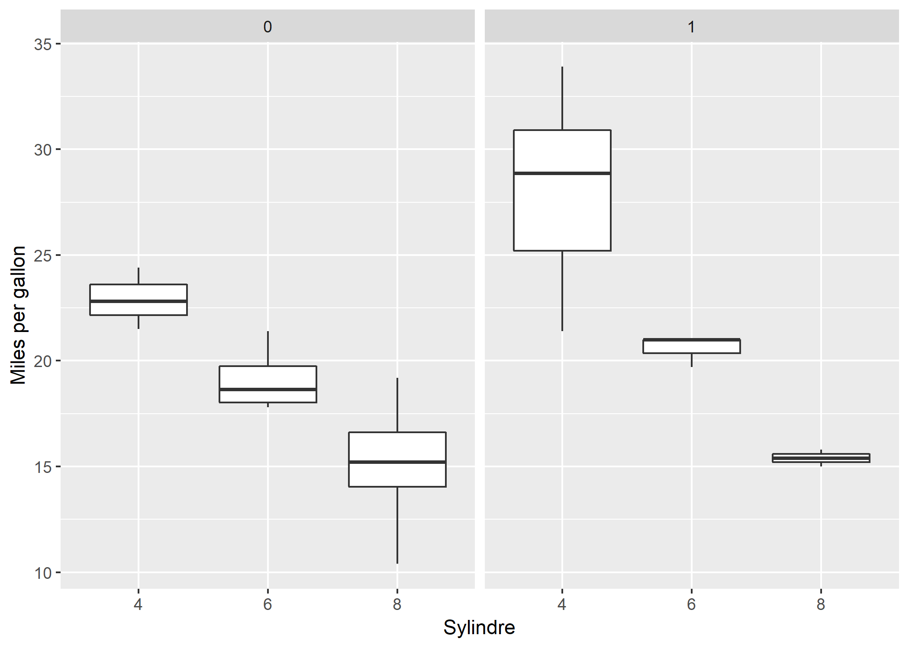

```{r setup, include=FALSE}
knitr::opts_chunk$set(echo = TRUE)
```

## Seminar 5

### Om prøven: 

* Vi skal gjennomgå noen få ting på starten av dagens seminar. Resten av seminaret er en forsmak på prøven.   
* Jeg anbefaler alle å ta en titt på indeksering, enten med `dplyr`, eller med `[,]` `subset()`. Alle bør i tillegg kjenne til `$`, `ifelse()`, logiske tester og innlasting av datasett `lm` og `cor`. Disse emnene er grunnleggende, men samtidig ikke nødvendigvis de letteste.
* Jeg har lagt ut et dokument med tips til feilsøking av problemer i R.
* Jeg legger ut en oversikt med funksjoner som er aktuelle til prøven før neste seminar. Med unntak av noen få funksjoner vil alt vi har gjennomgått være pensum.


### Oppsamlingsheat

Det er noen funksjoner som jeg ikke har gått grundig gjennom tidligere i seminarrekken, som jeg skal gjennomgå i dag, da de vil være pensum til prøven:

1. Boxplot
2. `facet_wrap()`
2. funksjoner for missing data
3. Korrelasjonsmatrise


### Boxplot:

Et boxplot viser fordelingen til en eller flere grupper på en kontinuerlig variabel visuelt. I midten av et boxplot er det en boks med en svart strek inne i boksen. Den svarte streken angir medianverdien til variabelen. Boksen viser fordelingen til den halvdelen av observasjonene som er i midten av fordelingen (mellom 1. og 3. kvartil, dvs. observasjonene mellom 25% og 75% av observasjonene ordnet fra lav til høy verdi). Ut fra boksene stikker det to streker, som er differansen mellom 3. og 1. kvartil gange med `1.5`. Uteliggere som ligger utenfor disse strekene, er plottet som separate punkter. Et boxplot angir dermed masse informasjon om fordelingen til en variabel, dere kan tenke på det som den visuelle ekvivalentent til `summary()`. For å lage et boxplot, bruker vi `ggplot()` med geom funksjonen `geom_boxplot()`. Boxplot er også nyttige for å se nærmere på hvordan ulike grupper fra variabler på nominalnivå/ordinalnivå (f.eks. kjønn) er fordelt på kontinuerlige variabler (som f.eks. inntekt). Her er et eksempel:


```{r, eval=FALSE}
library(ggplot2)
ggplot(mtcars, aes(as.factor(cyl), mpg)) + geom_boxplot() + labs(x = "Sylindre", y = "Miles per gallon")
```


```{r include=FALSE}
library(ggplot2)
ggplot(mtcars, aes(as.factor(cyl), mpg)) + geom_boxplot() + labs(x = "Sylindre", y = "Miles per gallon")
ggsave("../bilder/boxplot1.png")
```

```{r, echo=FALSE}
knitr::include_graphics("../bilder/boxplot1.png")
```


### `facet_wrap()`

Med `facet_wrap()`, kan vi lage mange plot på en gang med `ggplot`, basert på verdien til en variabel:


```{r, eval=FALSE}
library(ggplot2)
ggplot(mtcars, aes(as.factor(cyl), mpg)) + geom_boxplot() + labs(x = "Sylindre", y = "Miles per gallon") + facet_wrap(~ am) # am - 0 = automatgir, 1 manuell
```


```{r include=FALSE}
library(ggplot2)
ggplot(mtcars, aes(as.factor(cyl), mpg)) + geom_boxplot() + labs(x = "Sylindre", y = "Miles per gallon") + facet_wrap(~ am) # am - 0 = automatgir, 1 manuell
ggsave("../bilder/boxplot1_facet.png")
```

```{r, echo=FALSE}

```

### Funksjoner for missing data

Vi har sett på to nyttige funksjoner for missing data, `is.na()` og `complete.cases()`. Med `is.na()` kan vi gjøre en logisk test av om en variabel har missingverdier eller ikke, som f.eks:
```{r}
is.na(mtcars$mpg)
table(is.na(mtcars$mpg))
```

Med `complete.cases()` kan vi teste om en observasjon har missing på minst en variabel, f.eks.:
```{r}
complete.cases(mtcars[,3:8])
table(complete.cases(mtcars[,3:8]))
```

Disse funksjonene er nyttige både for å feilsøke problemer, og for å forstå missing i statistikk. Mer om dette under neste tema.

### Korrelasjonsmatrise

En korrelasjonsmatrise viser korrelasjon mellom mange variabler samtidig, og er en effektiv måte å raskt får oversikt over sammenhenger i et datasett. Under forklarer jeg korrelasjonsmatriser steg for steg.

Steg 1: Lag et numerisk datasett

En korrelasjonsmatrise lages med utgangspunkt i et datasett som kun består av numeriske variabler. Du kan teste om datasettet ditt kun har slike variabler ved hjelp av `str()`:
```{r}
str(mtcars)
```

Vi ser at alle variablene er av klassen `numeric` (num), så lenge vi kun har variabler av klassene `integer` eller `numeric` trenger vi ikke gjøre noen omkodinger. Dersom vi har variabler som ikke er numeriske, må vi enten lage et nytt datasett utenn disse variablene, eller omokde variablene slik at de blir numeriske. 


Steg 2: Beregn korrelasjoner

Nå skal du ha et datasett med kun numeriske variabler. Du kan nå forsøke å lage korrelasjonsmatrisen ved hjelp av `cor()`, som kan ta et numerisk datasett som første argument:

```{r}
cor(mtcars)
```


Steg 3: Missing

I dette eksempelet gikk alt smertefritt, men dersom du har missing-verdier, må du angi et argument for hvordan missing skal håndteres. Dette gjør du ved hjelp av argumentet `use = ` i `cor()` funksjonen. La oss legge inn noen missingverdier for å se hva som skjer:

```{r}
mydata <- mtcars
mydata$cyl[1:3] <- NA
mydata$mpg[3:5] <- NA
cor(mydata)
```

Alle korrelasjoner der `cyl` og `mpg` inngår er nå missing. Hvis vi velger `use = "complete.obs"` vil alle observasjoner som har missing på minst en variabel kastes ut før korrelasjoner beregnes. Resultatet blir det samme som om du lager et nytt datasett der du tar og fjerner dem som har `FALSE` på en logisk test med `complete.cases()`.

```{r}
cor(mydata, use = "complete.obs")
```

Hvis du velger `pairwise.complete.obs` vil observasjoner kun fjernes når de har missing på en variabel som inngår i en korrelasjon. Du kan sjekke hvilke observasjoner som fjernes i de enkelte bivariate korrelasjonene ved hjelp av `is.na()`:
```{r}
which(is.na(mydata$mpg)|is.na(mydata$cyl))
```

Her ser vi at i korrelasjonen mellom `mpg` og `cyl`, så vil observasjon 1-5 fjernes. I korrelasjonen mellom `cyl` og `hp` ser vi derimot at kun observasjon 1-3 vil fjernes når vi velger `use = "pairwise.complete.obs"`.

```{r}
which(is.na(mydata$hp)|is.na(mydata$cyl))
```

```{r}
cor(mydata, use="pairwise.complete.obs")
```


