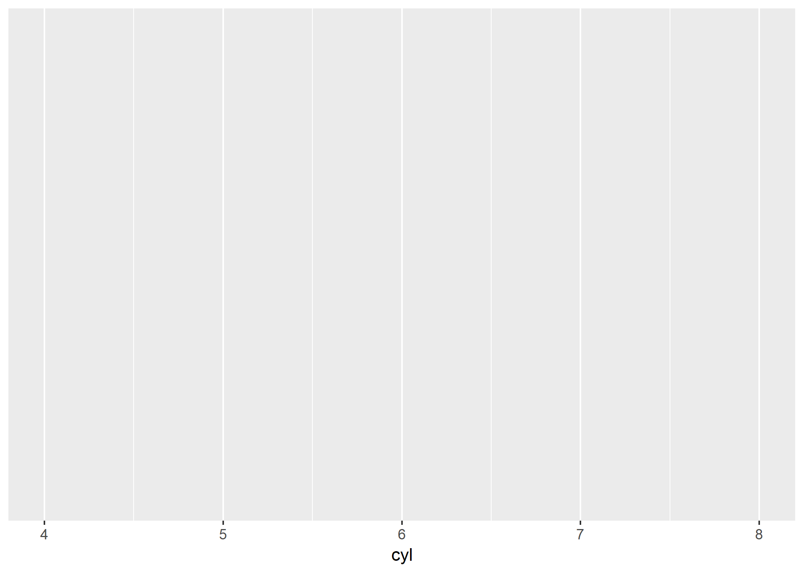
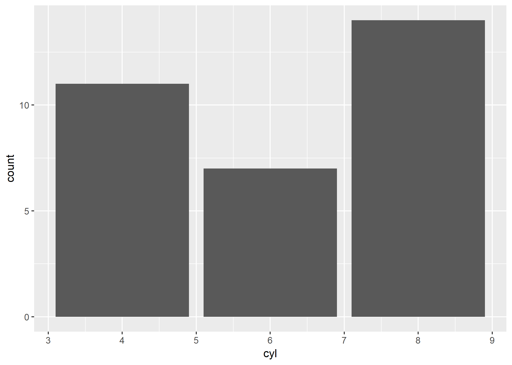
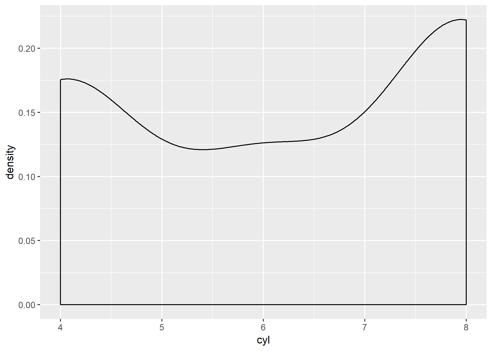
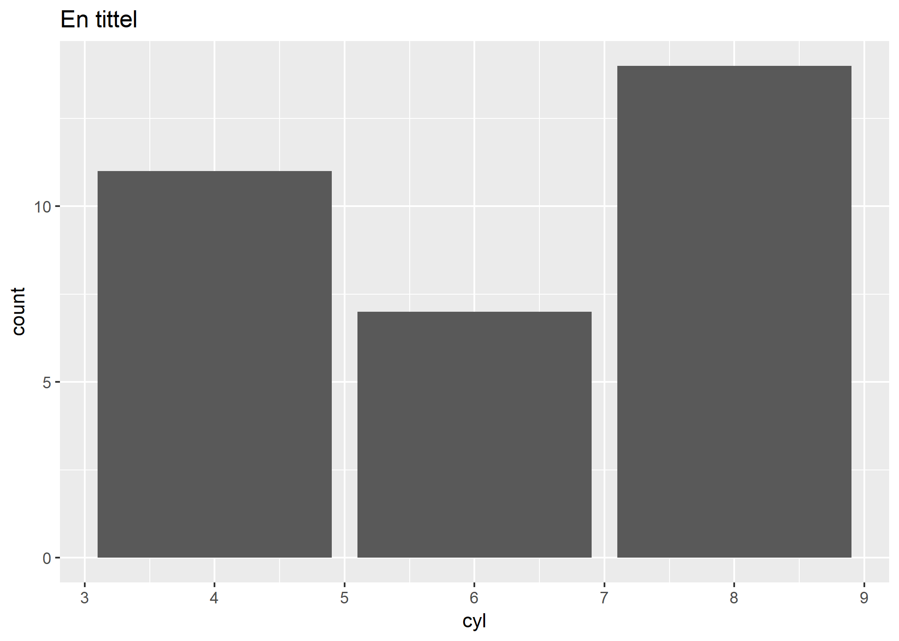
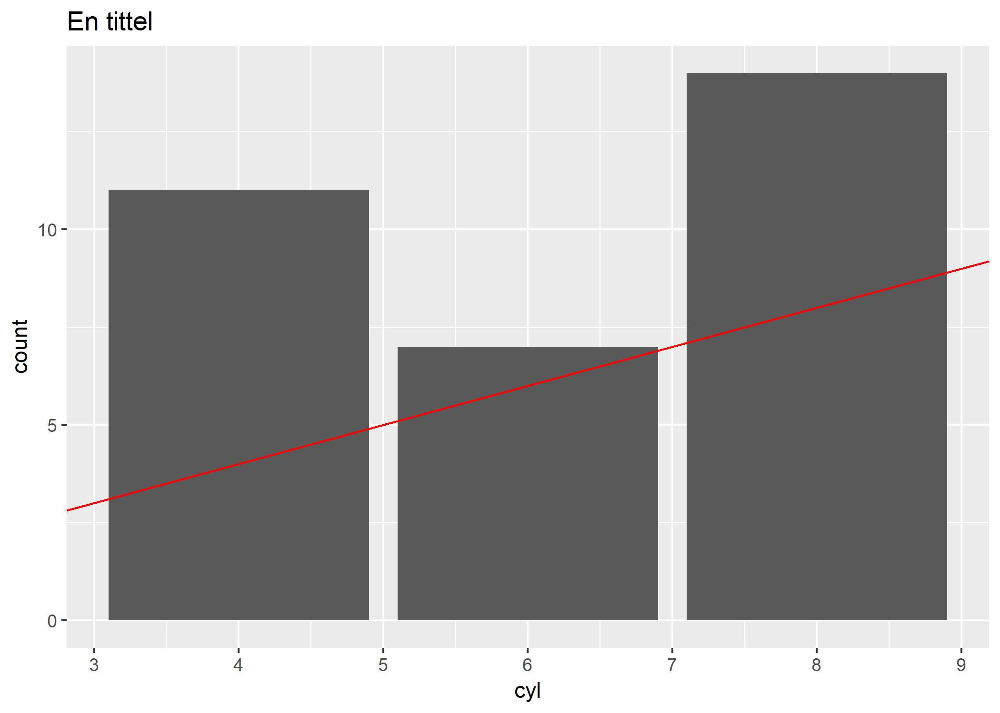

## Velkommen til introduksjonen til 2. R-seminar! 

Denne introduksjonen starter med å vise noen funksjoner for å gjøre deskriptiv statistikk. Deretter forklarer jeg hva `pakker` er for noe, og introduserer funksjoner fra to pakker, `dplyr` og `ggplot2`. Begge disse pakkene er en del av [tidyverse](https://www.tidyverse.org/), et sett av ypperlige pakker som gjør R til en mer brukervennlig opplevelse. En ypperlig gratis introduksjonsbok til R basert på tidyverse, finner dere [her](https://r4ds.had.co.nz/). Se også første modul i dette [kurset](https://www.datacamp.com/courses/introduction-to-the-tidyverse), dersom du er interessert i å lære mer.


I seminaret skal vi lære å importere datasett. Dersom du ikke husker hvordan mapper og **working directory** virker fra [installasjonsguiden](https://github.com/langoergen/stv1020R/blob/master/for_seminaret/for_seminar1.md), bør du ta en rask titt på forklaringen av dette før neste seminar. I denne introduksjonen skal vi imidlertid bruke et datasett som blir installert sammen med R, `mtcars` (forsøk å evaluere mtcars som kode i console).

## Statistiske mål

På forelesning har dere lært om mål for sentraltendens. I første seminar så vi på `mean()`. 
Funksjonen for medianverdien er `median()`, mens modus kan leses ut fra `table()`. 

På forelsening har dere også lære om spredningsmål. Maksimumsverdien til en variabel finner du med `max()`, mens minimumsverdien finner du med `min()`, disse funksjonene kan brukes til å finne variasjonsbredden. Andre funksjoner for spredningsmål er `sd()` og `var()`, lær mer med `?sd()` og `?var()`. En svært nyttig funksjon er `summary()`, den gir deg flere former for deskriptiv statistikk, inkludert kvartilene du trenger for å regne ut kvartildifferansen. 

Forsøk funksjonene på `mtcars$cyl` (variabelen sylindre i datasettet mtcars) i `Console` (jeg har lagt inn kode for en av funksjonene i boksen under. Du kan også forsøke funksjonene på andre variabler i `mtcars()` dersom du har lyst.


```r
mtcars
mtcars$cyl
min(mtcars$cyl)
```

## Tabeller

### Hvilke funksjon bruker vi for å lage tabeller? 

I denne seksjonen har jeg kun et spørsmål til deg, som tester  tilbake på forrige avsnitt når du svarer: 


```r
#Hvilke koder oppretter et objekt som inneholder en tabell med mtcars$cyl? (to alternativ er riktig)
tabell < tabell(mtcars$cyl)
tabbe <- table(mtcars$cyl)
objekt <- table(mtcars$cyl)
tabellen <- table(cyl)
sylindre <- tabell(mtcars$cyl)

# Svaret er riktig dersom objektet dukker opp i Global environment når du kjører koden.
```


## Pakker

Når man jobber med R, hender det noen ganger at man ikke finner en funksjon som gjør den jobben man skal ha gjort. I slike tilfeller, er det en god sjanse for at noen har laget en funksjon som gjør jobben for deg, og lagret den i en `pakke`. Pakker kan også inneholde datasett eller annen informasjon, men i seminarene skal vi først og fremst bruke pakker fordi de inneholder svært anvendelige funksjoner. Den vanligste måten å laste ned pakker på, er fra `CRAN`, som er et internasjonalt nettverk av webservere, som lagrer kvalitetssikret R-kode. Det finnes over 10 000 pakker på `CRAN`. For å laste ned en pakke fra `CRAN`, skriver vi koden `install.packages("pakkenavn")`, der `"pakkenavn"` byttes ut med navnet på pakken du skal bruke. Denne koden laster ned pakken, og lagrer `filene` pakken inneholder på pcen din, i en mappe som heter `library` (en undermappe under mappen for R-installasjonen din).

For å bruke funksjoner fra en pakke som vi har lastet ned, må vi også laste pakken inn i R. Dette gjør vi med koden `library(pakkenavn)`. 

I denne introduksjonen skal vi bruke to pakker, `ggplot2` og `dplyr`. Test at du har forstått kodene for å bruke pakker fra `CRAN` før du går videre:

**Hvilken av kode-alternativene i boksen under laster ned pakken `ggplot2`, for å deretter laste pakken inn i R?**

For å sjekke om du har gjort riktig, send det alternativet du tror er korrekt til `Console`. Klikk deretter på `Packages` i panelet nede til høyre i Rstudio (mellom `Help` og `Plots`). Dersom du har kjørt riktig kode, vil du se `ggplot2` med en hake ved siden av seg. Alternativt kan du kjøre koden `print(.packages())` i `Console`, og se om `ggplot2` blir returnert som en av pakkene som er lastet inn.  


```r
# Test deg selv: klarer du å finne riktig kode?

# Alternativ 1: 
install.packages(ggplot2)
library("ggplot2")

# Alternativ 2:
install.packages("pakkenavn") 
library(pakkenavn)

# Alternativ 3:
install.packages("ggplot2")
library(ggplot2)

# Alternativ 4:
install.packages(moments)
library(moments)
```

Gratulerer, du har nå installert din første pakke! For å sjekke at du virkelig har forstått installasjon og innlasting av pakker, kan du gjøre det samme for `dplyr` med det samme. Jeg viser koden for å installere denne pakken lenger ned i denne introduksjonen.


## Grafikk

I denne seksjonen skal vi lage et stolpediagram. Til dette formålet skal vi bruke funksjonen `ggplot()` fra pakken `ggplot2`. Jeg har kjørt koden for deg (forutsetter at du har installert `ggplot2` med `install.packages("ggplot2")`). Din jobb er å lese forklaringene, og se på plottene.


```r
library(ggplot2)
```

Nå som du har lastet inn `ggplot2`, kan vi lage et stolpediagram. Til dette formålet skal vi bruke funksjonen `ggplot()`, som er en del av pakken `ggplot2`. Under følger kode med en forklaring av hvordan `ggplot()`fungerer. Kjør raskt gjennom koden i boksene under, og forsøk så godt du kan å forstå hva som skjer. 

Først definerer vi hva vi skal plotte. Første argument i `ggplot()` spesifiserer et datasett, inne i argumentet aes() spesifiserer vi variabler fra datasettet vi har lyst til å plotte. Dersom vi har lyst til å plotte en variabel på x-aksen spesifiserer vi `x = variabel1`. Dersom vi vil plotte en variabel på y-aksen også, spesifiserer vi `y = variabel2`. Kjør koden under før du fortsetter. 


```r
ggplot(mtcars, aes(x=cyl)) 
```





Vi har nå fått et tomt plot, men på x-aksen har vi fått variabelen `cyl`, med verdier som dekker variasjonsbredden til variabelen. Vi kan nå legge til et argument for å bestemme hvordan vi vil plotte variabelen. Dette gjør vi ved å skrive `+` etter den linjen vi allerede har sendt, og deretter spesifisere et `geom_` argument. Det finnes en rekke `geom_`argumenter, eksempelvis for stolpediagramm, histogram og scatterplot en oversikt over slike argumenter, se [her](http://ggplot2.tidyverse.org/reference/#section-layer-geoms). For å lage stolpediagram, velger vi å bruke argumentet `geom_bar()`:


```r
ggplot(mtcars, aes(x=cyl)) + geom_bar()
```




Vi kunne valgt et annet `geom_`, som `geom_density`:


```r
ggplot(mtcars, aes(x=cyl)) + geom_density()
```




Dersom vi vil legge til enda flere argumenter, for eksempel for å pynte plottet, bruker vi `+` etter siste argument. La oss legge til en tittel: 


```r
ggplot(mtcars, aes(x=cyl)) + 
  geom_bar() +
  ggtitle("En tittel")
```




Det er svært mange argumenter som lar deg pynte et `ggplot`,  det er som regel mulig å gjøre den endringen du måtte ønske med et lite tilleggsargument. Det er også mulig å legge flere lag oppå hverandre i `ggplot`. Under demonstrerer jeg dette ved å legge til en rød linje over stolpediagrammet. Disse mulighetene gjør `ggplot()` til en svært effektiv måte å fremstille data på visuelt.


```r
ggplot(mtcars, aes(x=cyl)) + 
  geom_bar() + 
  geom_abline(col = "red") +
  ggtitle("En tittel")
```




## Indeksering med dplyr

I forrige seksjon brukte vi `+` for å kombinere ulike grafiske funksjoner for å produsere et plot. Med `dplyr` bruker vi `%>%` for å binde sammen ulike operasjoner vi vil utføre på et datasett. Dette kalles for piping. Det er en effektiv og ryddig måte å kode på. Derfor kommer jeg ofte til å bruke pipes i seminarene. Under viser jeg hvordan du kan indeksere datasett med `filter()` funksjonen fra dplyr, og en logisk test. Her velger jeg biler som har mer enn 4 sylindre


```r
#install.packages(dplyr) # kjør hvis du ikke har dplyr installert
library(dplyr)
```

```
## 
## Attaching package: 'dplyr'
```

```
## The following objects are masked from 'package:stats':
## 
##     filter, lag
```

```
## The following objects are masked from 'package:base':
## 
##     intersect, setdiff, setequal, union
```

```r
# Linje 1: skriver navn på datasett, da skjønner R at den skal lete etter navn der
mtcars %>%        
  filter(cyl >4) # Velger biler med mer en 4 sylindre, cyl er en variabel i mtcars
```

```
##     mpg cyl  disp  hp drat    wt  qsec vs am gear carb
## 1  21.0   6 160.0 110 3.90 2.620 16.46  0  1    4    4
## 2  21.0   6 160.0 110 3.90 2.875 17.02  0  1    4    4
## 3  21.4   6 258.0 110 3.08 3.215 19.44  1  0    3    1
## 4  18.7   8 360.0 175 3.15 3.440 17.02  0  0    3    2
## 5  18.1   6 225.0 105 2.76 3.460 20.22  1  0    3    1
## 6  14.3   8 360.0 245 3.21 3.570 15.84  0  0    3    4
## 7  19.2   6 167.6 123 3.92 3.440 18.30  1  0    4    4
## 8  17.8   6 167.6 123 3.92 3.440 18.90  1  0    4    4
## 9  16.4   8 275.8 180 3.07 4.070 17.40  0  0    3    3
## 10 17.3   8 275.8 180 3.07 3.730 17.60  0  0    3    3
## 11 15.2   8 275.8 180 3.07 3.780 18.00  0  0    3    3
## 12 10.4   8 472.0 205 2.93 5.250 17.98  0  0    3    4
## 13 10.4   8 460.0 215 3.00 5.424 17.82  0  0    3    4
## 14 14.7   8 440.0 230 3.23 5.345 17.42  0  0    3    4
## 15 15.5   8 318.0 150 2.76 3.520 16.87  0  0    3    2
## 16 15.2   8 304.0 150 3.15 3.435 17.30  0  0    3    2
## 17 13.3   8 350.0 245 3.73 3.840 15.41  0  0    3    4
## 18 19.2   8 400.0 175 3.08 3.845 17.05  0  0    3    2
## 19 15.8   8 351.0 264 4.22 3.170 14.50  0  1    5    4
## 20 19.7   6 145.0 175 3.62 2.770 15.50  0  1    5    6
## 21 15.0   8 301.0 335 3.54 3.570 14.60  0  1    5    8
```

```r
# samme kode, men oppretter et nytt datasett med bilene som har mer enn 4 sylindre
rask_bil <- mtcars %>%        
  filter(cyl >4)
```

Med `dplyr`kan vi også velge mange variabler fra et datasett på en og samme tid, til dette bruker vi funksjonen `select()`.


```r
mtcars %>% 
  select(cyl,
         mpg,
         gear) # velger tre variabler, se names(mtcars) 
```

```
##                     cyl  mpg gear
## Mazda RX4             6 21.0    4
## Mazda RX4 Wag         6 21.0    4
## Datsun 710            4 22.8    4
## Hornet 4 Drive        6 21.4    3
## Hornet Sportabout     8 18.7    3
## Valiant               6 18.1    3
## Duster 360            8 14.3    3
## Merc 240D             4 24.4    4
## Merc 230              4 22.8    4
## Merc 280              6 19.2    4
## Merc 280C             6 17.8    4
## Merc 450SE            8 16.4    3
## Merc 450SL            8 17.3    3
## Merc 450SLC           8 15.2    3
## Cadillac Fleetwood    8 10.4    3
## Lincoln Continental   8 10.4    3
## Chrysler Imperial     8 14.7    3
## Fiat 128              4 32.4    4
## Honda Civic           4 30.4    4
## Toyota Corolla        4 33.9    4
## Toyota Corona         4 21.5    3
## Dodge Challenger      8 15.5    3
## AMC Javelin           8 15.2    3
## Camaro Z28            8 13.3    3
## Pontiac Firebird      8 19.2    3
## Fiat X1-9             4 27.3    4
## Porsche 914-2         4 26.0    5
## Lotus Europa          4 30.4    5
## Ford Pantera L        8 15.8    5
## Ferrari Dino          6 19.7    5
## Maserati Bora         8 15.0    5
## Volvo 142E            4 21.4    4
```

```r
# Oppretter nytt datasett med de tre variablene
rask_bil2 <- mtcars %>% 
  select(cyl,
         mpg,
         gear)
```

La oss kombinere det vi har lært så langt - `dplyr` og pipes lar oss gjøre mange ting på en gang:


```r
mtcars %>% 
  filter(cyl >4) %>%
  select(mpg, gear, cyl)
```

```
##     mpg gear cyl
## 1  21.0    4   6
## 2  21.0    4   6
## 3  21.4    3   6
## 4  18.7    3   8
## 5  18.1    3   6
## 6  14.3    3   8
## 7  19.2    4   6
## 8  17.8    4   6
## 9  16.4    3   8
## 10 17.3    3   8
## 11 15.2    3   8
## 12 10.4    3   8
## 13 10.4    3   8
## 14 14.7    3   8
## 15 15.5    3   8
## 16 15.2    3   8
## 17 13.3    3   8
## 18 19.2    3   8
## 19 15.8    5   8
## 20 19.7    5   6
## 21 15.0    5   8
```

Du er nå godt forberedt til neste seminar, tusen takk for at du tok deg tid til å jobbe gjennom introduksjonen!


